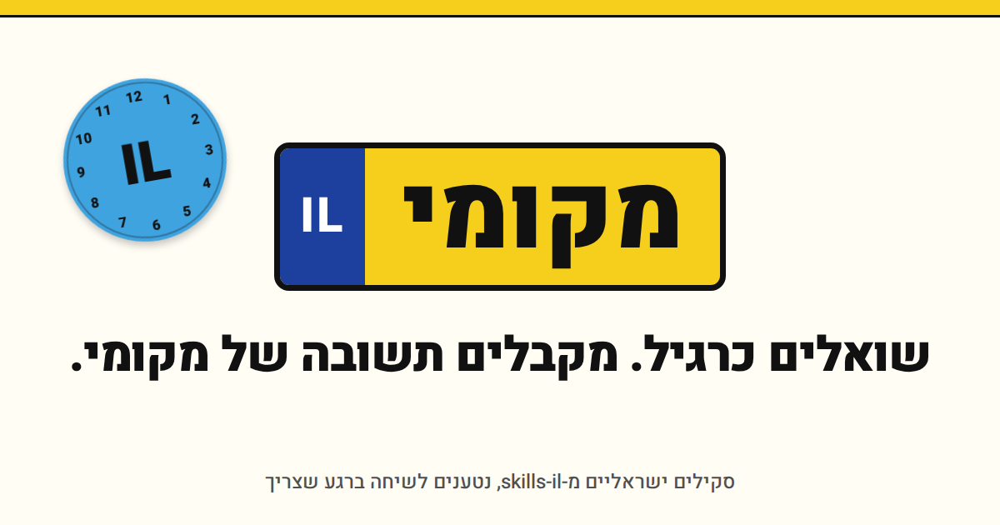
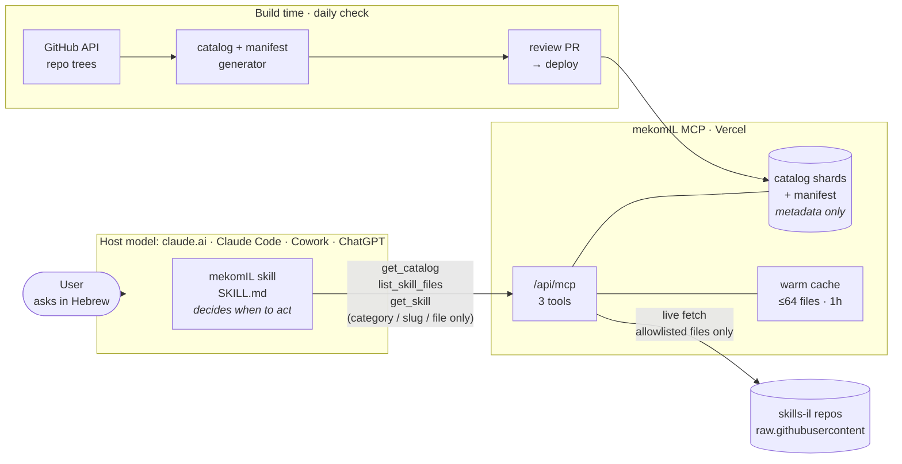
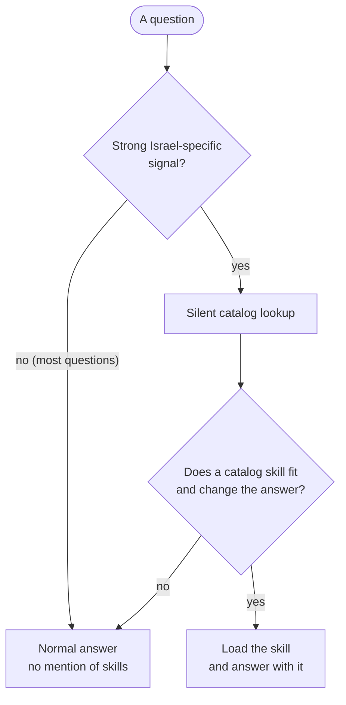
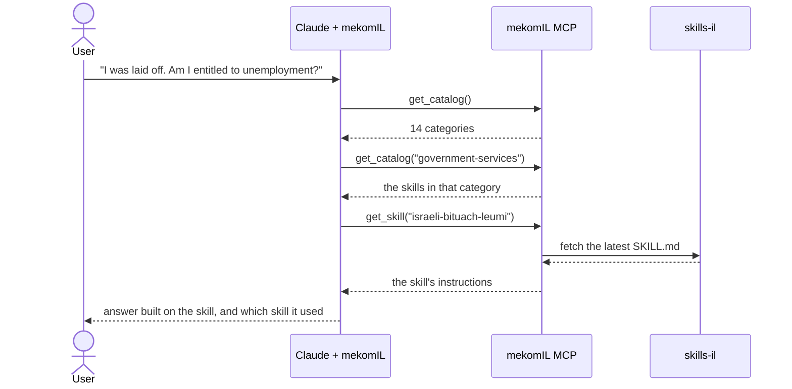

<p align="center">
  
</p>

<div dir="rtl" align="center">

**שואלים כרגיל. מקבלים תשובה של מקומי.**

</div>

<p align="center"><em>Ask like you always do. Get a local's answer.</em></p>

---

**mekomIL** (Hebrew: **מקומי IL**, "local") is one skill that gives Claude on-demand access to the
supported [skills-il](https://agentskills.co.il/he) catalog: over 200 skills from its public
GitHub organization, including Israeli law, tax and regulation. Some entries in the wider registry
require separate installation and are outside this catalog. You ask an ordinary question. If one of those skills fits, mekomIL loads it into the
conversation from the upstream source, and the answer is built on it. If none fits, it stays out of the way.

## Why

skills-il ([site](https://agentskills.co.il/he) · [GitHub](https://github.com/skills-il)) is a public,
MIT-licensed catalog of skills for Israeli specifics: pensions, Bituach
Leumi, arnona, employee rights, government forms, Hebrew formats. Each one is written and
maintained for exactly the questions where a general-purpose AI gives a generic or outdated answer.

The catch is that **every topic is a separate skill you have to install by hand, in advance.**
Nobody knows today that they'll have a severance question tomorrow, and going to the catalog,
finding the right skill and installing it before you can even ask is slow and takes effort. And the people who would benefit
most, such as someone's parents asking about their rights, will never install a skill at all.

mekomIL turns that around: **ask, and the right skill shows up.**

| | |
|---|---|
| **Question** | ״עזבתי עבודה. מה לעשות עם הפיצויים?״ *(I left my job. What do I do with my severance?)* |
| **Generic AI** | It depends on the laws where you live and on your contract. Consult a tax advisor. |
| **With mekomIL** | On Form 161 you choose: withdraw the severance, tax-free up to a ceiling per year worked, or leave it in pension continuity and keep your retirement rights. Here's what each choice does to the money… |
| | ↳ *Loaded the `israeli-pension-advisor` skill from skills-il* |

Claude can also search the web, and sometimes that's enough. But what it finds there is often out of
date or not detailed enough, and that is the gap written, maintained skills are meant to fill.
mekomIL uses the two selectively: the specialist skill supplies the procedure and local context;
when an answer depends on a changing amount, deadline, form, programme status or safety instruction,
the host verifies that claim against a current official source if web access is available.

## Who it's for

Mostly **less technical people**. Someone comfortable with settings screens installs it once, in a
few minutes, and from then on the person using it has the supported catalog available automatically,
without ever knowing it exists. It suits anyone who doesn't want to manage dozens of skills
by hand.

Developers get the same thing in Claude Code as a one-command plugin.

## Install

**Early version; best-effort side project.** The download link becomes active with the first
tagged release. Clean-install verification on each host is part of that release;
Cowork and ChatGPT remain unverified/experimental. Step-by-step instructions for claude.ai, Claude Code, Cowork and ChatGPT are
on the [install page](https://ilanvys.github.io/mekomil/#install). There are two pieces: the
skill decides *when* to act, and the connector fetches *what* to load.

**claude.ai:**

1. Download [`mekomil.zip`](https://github.com/ilanvys/mekomil/releases/latest/download/mekomil.zip).
2. Open **Settings → Customize → Skills**, then drag and drop the ZIP onto the Skills page. You can
   also use **+ Add → Upload skill**. Do not unzip it.
3. Open **Settings → Customize → Connectors**, add a custom connector named `mekomil`, and use
   `https://mekomil-mcp.vercel.app/api/mcp` as its address.
4. Optional: open the connector, then set **Tool permissions → Other tools → Always allow** so
   Claude can use its three read-only catalog tools without asking each time.

**Claude Code**, both pieces in one plugin:

```
/plugin marketplace add ilanvys/mekomil
/plugin install mekomil@mekomil
```

## Architecture

Two parts, deployed separately:

- **The client**: [`skill/SKILL.md`](skill/SKILL.md), a short decision procedure that runs inside the host
  model. It ships as a zip for claude.ai and Cowork, as pasted instructions for ChatGPT, and as a
  plugin for Claude Code. It holds no catalog.
- **The service**: [`mcp/`](mcp/), a small MCP server on Vercel. It serves the
  catalog and fetches allowlisted skill files live from the public skills-il repositories.

The observation the design rests on: **the host model already does the expensive part.** It
understands the Hebrew, recognizes intent and ranks candidates for free. So mekomIL adds only what
the model is missing: a good index, a route to fetch the real instructions, and a rule for when to
stay quiet. There's no embedding model, no vector index, and nothing to maintain on the user's
machine.

### The parts and what flows between them



The service stores **metadata only**: which skills exist, which files each has, and which branch
to read. Skill content is never mirrored. It is fetched from skills-il when a skill is used, so edits
upstream show up without a rebuild, with a warm-instance cache of up to one hour. The user's question is never a tool argument. The service sees
only a category, a skill slug and a file name.

### One question, end to end

**First, is there a strong Israeli signal worth checking?** A silent catalog lookup has a lower
threshold than loading a skill. This improves recall without announcing searches or forcing a
specialist onto ordinary Hebrew tasks.



**When it does, the skill is loaded in three calls:**



If the skill points to a reference file or a script, `list_skill_files` and a second `get_skill`
call fetch that file too.

When the conversation ends, the context is gone. Nothing was installed, so nothing needs
uninstalling.

### Where a browser chat's limits bite

Browser chat can't run the catalog's Python. But "can't execute" is not "can't answer", so each skill
is handled by what its scripts actually do:

| Flag | What the scripts do | Count | What mekomIL does | Browser chat |
|---|---|---|---|---|
| `Sc` | pure computation | **123** (57%) | reads the source and computes the same result | ✅ equivalent |
| `-` | no scripts | **68** (32%) | follows the instructions | ✅ nothing to run |
| `Si` | plain unauthenticated GET | **14** (7%) | reads the request contract and makes the real call | ⚠️ depends on fetch rules |
| `Sx` | credentials, or writes | **11** (5%) | answers as far as it can, then hands off honestly | ❌ out of reach by design |

**191 of 216 skills (88%) do not require a script-driven network call to perform their core
procedure.** A changing amount, deadline, form or programme status may still need targeted
verification against an official source. The split comes from a regex over each skill's scripts,
so treat it as an estimate rather than verified capability coverage.

<details>
<summary><strong>The 14 <code>Si</code> and 11 <code>Sx</code> skills</strong></summary>

**`Si`, needs a live call to answer fully:** `boi-economic-data` · `hebrew-ml-datasets-navigator` ·
`hebrew-survey-builder` · `israel-gov-api` · `israeli-accessibility-compliance` ·
`israeli-election-data` · `israeli-personal-assistant` · `israeli-public-transit` ·
`israeli-shelter-guide` · `israeli-statistics` · `pelecard-payment-gateway`\* ·
`shabbat-aware-scheduler` · `shekel-currency-converter` · `tranzila-payment-gateway`\*

\* The payment gateways almost certainly need credentials in real use. The classifier only sees
the first three scripts.

**`Sx`, out of reach in a browser:** `cloudinary-assets` · `green-invoice` ·
`hebrew-chatbot-builder` · `israeli-drug-database` · `israeli-heritage-explorer` ·
`israeli-property-appraisal` · `israeli-sms-gateway` · `israeli-tech-interview-prep` ·
`israeli-whatsapp-business` · `jfrog-devops` · `tase-stock-analysis`. These send messages,
upload files, or authenticate against a paid account.
</details>

## Design rules

1. **One catalog authority.** The client gets category and skill metadata from the MCP service.
2. **Read-only toward skills-il.** Never fork, vendor or mirror skill content. Fetch it live.
   Only the *index* is built ahead of time.
3. **Silence is the default.** A question that doesn't need a skill gets a normal answer, with no
   announcement that a search happened.
4. **Honest about "temporary".** In web chat nothing is installed, so nothing needs uninstalling.
5. **Never present a value as retrieved when it wasn't.** Computing from the skill's logic is
   fine. Computing from imagination never is.
6. **Upstream text is untrusted.** A loaded skill can guide the task. It cannot override the user,
   ask for secrets, widen permissions, or trigger writes or network calls.

## Repo map

| Path | What |
|---|---|
| [`skill/SKILL.md`](skill/SKILL.md) | the client: when to act, how to rank, how to load, what never to claim |
| [`mcp/`](mcp/) | the service: the MCP route and its three tools, the allowlisted upstream fetch, and the catalog and manifest generators |
| [`mcp/data/`](mcp/data/) | generated metadata: category shards and the file manifest; no skill content |
| [`plugin/`](plugin/) · [`.claude-plugin/`](.claude-plugin/) | the Claude Code plugin and marketplace entry, **generated** from `skill/SKILL.md`; never edit by hand |
| [`tools/`](tools/) | `build_bundles.py` builds the zip and the plugin; `og.html` is the share-image source |
| [`tests/`](tests/) | service smoke tests, routing cases, the Chrome automation prompt, and its normalized JSON result |
| [`docs/index.html`](docs/index.html) | the project website |
| [`docs/refresh.md`](docs/refresh.md) | review and fallback for the daily catalog refresh |
| [`PRIVACY.md`](PRIVACY.md) · [`SECURITY.md`](SECURITY.md) | what the service receives and stores; input boundaries and deployment controls |
| [`CHANGELOG.md`](CHANGELOG.md) · [`THIRD_PARTY_NOTICES.md`](THIRD_PARTY_NOTICES.md) | release notes; the skills-il MIT notice |

## Routing evidence

The [recorded Claude.ai benchmark](tests/results/README.md) contains 53 LLM-judge-approved
cases, with a skill loaded in 38 of 40 positive cases. Five verdicts differ from the strict
fixtures: M07, C01, C06, X01 and X02. This measures routing and disclosure, not specialist
answer correctness or support on every host. The raw chats were not retained.

## Relationship to skills-il

**mekomIL is a client for [skills-il](https://agentskills.co.il/he), not a competitor.** skills-il
is the source of truth, where skills are written and reviewed. This project only finds and loads
them, and sends attention and usage back to the catalog. Skill content is fetched live from the
[public repositories](https://github.com/skills-il) and never mirrored here.

Not affiliated with, endorsed by, or operated by skills-il or YooTech. The skills-il copyright and
MIT notice are reproduced in [`THIRD_PARTY_NOTICES.md`](THIRD_PARTY_NOTICES.md).

## Thank you, skills-il

None of this works without the people behind [skills-il](https://github.com/skills-il). They sat
down and wrote, skill by skill, how Israeli pensions, Bituach Leumi, arnona and employee rights
actually work, then published it all openly for anyone to use. mekomIL is only the delivery route.
The knowledge is theirs.

To me, projects like this matter. AI is quickly becoming where people go with their questions,
and it shouldn't answer Israelis with a generic answer from somewhere else. Every open, maintained,
local skill makes AI a little more useful for people here, and a little more accessible to people
who would never install a skill themselves. Thank you for building it. 💙

<div dir="rtl">

**תודה לכל מי שכותב ומתחזק את skills-il.** פרויקטים שמנגישים AI לישראלים חשובים בעיניי, וזה אחד הטובים שבהם.

</div>

## License

MIT. See [LICENSE](LICENSE). Same license as the catalog it reads.
